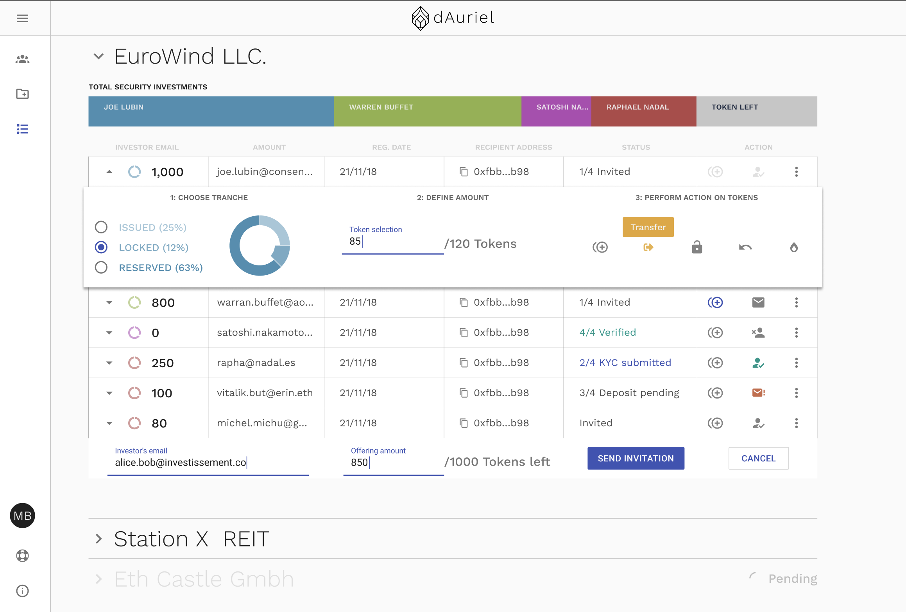
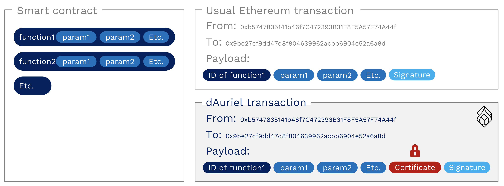
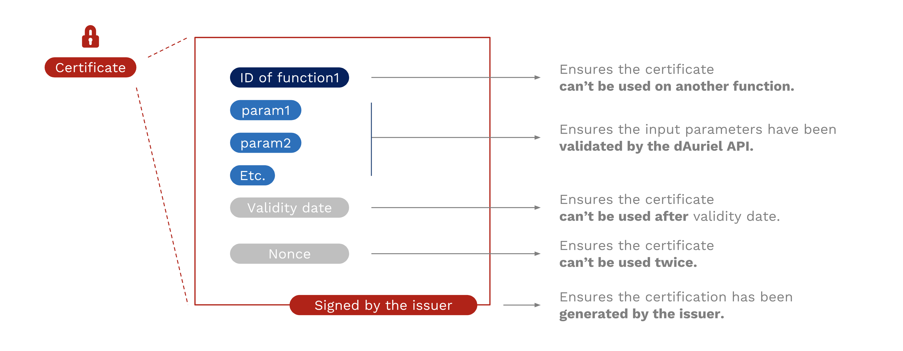

## What is dAuriel?

dAuriel is an advanced institutional technology platform for issuing and exchanging tokenized financial assets, powered by the Ethereum blockchain.
dAuriel is a product created by ConsenSys.

## Content - Security token implementations (ERC777 and ERC1400), adapted for financial asset tokenization

This repo contains security token smart contract implementations used by dAuriel:
#### ERC777 implementation - Advanced token standard for asset transfers

 - Empowerment of operators with the ability to send tokens on behalf of other addresses.
 - Setup of send/receive hooks to offer token holders more control over their tokens.
 - Use of ER820([eips.ethereum.org/EIPS/eip-820](https://eips.ethereum.org/EIPS/eip-820)) to notify contracts and regular addresses when they receive tokens.
 - Backwards compatible with ERC20.


#### ERC1400 implementation - Partially fungible token standard

 - Differentiated ownership / transparent restrictions.
 - Controller operations (force transfer).
 - On-chain restriction checking with error signalling, off-chain data injection for transfer restrictions and issuance / redemption semantics.
 - Document management.
 - Backwards compatible with ERC20 and ERC777.

## Objective - Financial asset issuance & management

The current capital market still needs to overcome a few pain points:
 - Today, it is cumbersome and costly to issue an asset.
 - Once issued, the assets are mainly reserved for high-ticket investors.
 - Finally, those asset are not easily tradable, which strongly limits the secondary market possibilities.

With dAuriel, we want to tokenize the capital market to tackle those pain points. In the new system, we imagine:
 - An asset issuance will be faster, simpler but also cheaper than today.
 - This reduction of costs will allow us to onboard smaller ticket investors.
 - Globally, the tokenization removes constraints for more liquid and frictionless asset transfers, while keeping a strong control over the market, thus liberating the secondary market.

The security token standards contained in this repository, combined to user-friendly interfaces, can be leveraged for financial asset issuance & management:



## Approach - Introduce a new transfer standard to provide issuers with strong control capabilities over their financial assets

### Introduction - The limits of ERC20 token standard

Currently the most common and well-known standard within crypto community is the ERC20([eips.ethereum.org/EIPS/eip-20](https://eips.ethereum.org/EIPS/eip-20)).
While the vast majority of ICOs are based on this ERC20 standard, it appears not to be the most relevant for financial asset tokenization.
The only parameters required to perform an ERC20 token transfer are the recipient's address and the value of the transfer, thus limiting the control possibilities over transfers:
```
function transfer(address recipient, uint256 value)
```
All controls have to be hard-coded on-chain and are often limited to simple / binary checks e.g. checking whether an investor is blacklisted or not.

dAuriel makes use of more evolved / granular controls to secure transfers.
Those controls can evolve quickly and require flexibility, which makes it difficult to hard-code them on-chain.

### dAuriel transaction - A way to secure all transfers with a certificate generated off-chain by the issuer

The use of an additional 'data' parameter in the transfer functions can enable more evolved / granular controls:
```
function transferWithData(address recipient, uint256 value, bytes data)
```
dAuriel fosters to use this additional 'data' field (available in ERC777 and ERC1400 standards) to inject a certificate generated off-chain by the issuer.
A token transfer shall be conditioned to the validity of the certificate, thus offering the issuer with strong control capabilities over its financial assets.



### dAuriel certificate - A way to perform advanced conditional ownership

The dAuriel certificate contains:
 - The function ID which ensures the certificate can’t be used on an other function.
 - The parameters which ensures the input parameters have been validated by the issuer.
 - A validity date which ensures the certificate can’t be used after validity date.
 - A nonce which ensures the certificate can’t be used twice.

Finally the certificate is signed by the issuer which ensures it is authentic.

The certificate enables the issuer to perform advanced conditional ownership, since he needs to be aware of all parameters of a function call before generating the associated certificate.



## Detailed presentation - Standards description & implementation choices

### ERC777

The [ERC777](contracts/token/ERC777/ERC777.sol) is an advanced token standard adapted for regulated asset transfers, since it allows to inject data (i.e. our certificate) in the transfer transactions:
```
function transferWithData(address recipient, uint256 value, bytes data)
```

The official proposal can be found at: [eips.ethereum.org/EIPS/eip-777](https://eips.ethereum.org/EIPS/eip-777).

We've performed a few updates compared to the official proposal, mainly to better fit with our implementation of ERC1400:
 - Introduction of the notion of 'controllers' (replacing defaultOperators) for better consistency with ERC1400 'controllers'.
 - Introduction of '_isControllable' property (set to 'false' by default for the ERC777, but set to 'true' for the ERC1400).
 - Renaming of 'send' function (now 'transferWithData') and 'Sent' event (now 'TransferWithData') for better consistency with ERC1400 names + to avoid potential issues with blockchain tools (e.g. Truffle, etc.) considering 'send' as a reserved word.
 - Renaming of 'mint' function (now 'issue') and 'Minted' event (now 'Issued') for better consistency with ERC1400 names.
 - Renaming of 'burn' function (now 'redeem') and 'Burned' event (now 'Redeemed') for better consistency with ERC1400 names.
 - Renaming of 'operatorBurn' function (now 'redeemFrom') for better consistency with ERC1400 names.

ERC777 can be made compatible with ERC20 (see [ERC777ERC20.sol](contracts/token/ERC20/ERC777ERC20.sol)).
This backwards compatibility property offers interoperability, as ERC20 tokens are compatible with most existing exchange platforms.

It implements the [following interface](contracts/token/ERC777/IERC777.sol):
```
interface IERC777 {

  function name() external view returns (string);
  function symbol() external view returns (string);
  function totalSupply() external view returns (uint256);
  function balanceOf(address owner) external view returns (uint256);
  function granularity() external view returns (uint256);

  function controllers() external view returns (address[]);
  function authorizeOperator(address operator) external;
  function revokeOperator(address operator) external;
  function isOperatorFor(address operator, address tokenHolder) external view returns (bool);

  function transferWithData(address to, uint256 value, bytes data) external;
  function transferFromWithData(address from, address to, uint256 value, bytes data, bytes operatorData) external;

  function redeem(uint256 value, bytes data) external;
  function redeemFrom(address from, uint256 value, bytes data, bytes operatorData) external;

  event TransferWithData(
    address indexed operator,
    address indexed from,
    address indexed to,
    uint256 value,
    bytes data,
    bytes operatorData
  );
  event Issued(address indexed operator, address indexed to, uint256 value, bytes data, bytes operatorData);
  event Redeemed(address indexed operator, address indexed from, uint256 value, bytes data, bytes operatorData);
  event AuthorizedOperator(address indexed operator, address indexed tokenHolder);
  event RevokedOperator(address indexed operator, address indexed tokenHolder);

}
```

### ERC1400

The [ERC1400](contracts/ERC1400.sol) has an additional feature on top of ERC777 properties: the partial fungibility property.
This property allows to perform corporate actions, like mergers and acquisitions, which is essential for financial assets.

The original submission with discussion can be found at: [github.com/ethereum/EIPs/issues/1411](https://github.com/ethereum/EIPs/issues/1411).

We've performed a few updates compared to the original submission, mainly to fit with business requirements + to save gas cost of contract deployment:
 - Compatibility with ERC777 as all ERC777 properties are business requirements for financial asset tokenization (incl. send/receive hooks and ERC820 which are used to ensure transfer atomicity).
 - Modification of view functions ('canTransferByPartition', 'canOperatorTransferByPartition') as consequence of our certificate design choice: the view functions need to have the exact same parameters as 'transferByPartition' and 'operatorTransferByPartition' in order to be in measure to confirm the certificate's validity.
 - Removal of controller functions ('controllerTransfer' and 'controllerRedeem') and events ('ControllerTransfer' and 'ControllerRedemption') to save gas cost of contract deployment. Those controller functionnalities have been included in 'transferByPartition' and 'redeemByPartition' functions instead.
 - Split of ERC1400 functions into 2 interfaces (IERC1410 for asset transfer logic + IERC1400 for asset issuance/redemption logic) for better readability.

ERC1400 is compatible with ERC777 and can be made compatible with ERC20 (see [ERC1400ERC20.sol](contracts/token/ERC20/ERC1400ERC20.sol)).
This backwards compatibility property offers interoperability, as ERC20 tokens are compatible with most existing exchange platforms.

The standard implements the following interfaces: [IERC1410](contracts/token/ERC1410/IERC1410.sol) + [IERC1400](contracts/IERC1400.sol):
```
interface IERC1410 {

    // Token Information
    function balanceOfByPartition(bytes32 partition, address tokenHolder) external view returns (uint256);
    function partitionsOf(address tokenHolder) external view returns (bytes32[]);

    // Token Transfers
    function transferByPartition(bytes32 partition, address to, uint256 value, bytes data) external returns (bytes32);
    function operatorTransferByPartition(bytes32 partition, address from, address to, uint256 value, bytes data, bytes operatorData) external returns (bytes32);

    // Default Partition Management
    function getDefaultPartitions(address tokenHolder) external view returns (bytes32[]);
    function setDefaultPartitions(bytes32[] partitions) external;

    // Operators
    function controllersByPartition(bytes32 partition) external view returns (address[]);
    function authorizeOperatorByPartition(bytes32 partition, address operator) external;
    function revokeOperatorByPartition(bytes32 partition, address operator) external;
    function isOperatorForPartition(bytes32 partition, address operator, address tokenHolder) external view returns (bool);

    // Transfer Events
    event TransferByPartition(
        bytes32 indexed fromPartition,
        address operator,
        address indexed from,
        address indexed to,
        uint256 value,
        bytes data,
        bytes operatorData
    );

    event ChangedPartition(
        bytes32 indexed fromPartition,
        bytes32 indexed toPartition,
        uint256 value
    );

    // Operator Events
    event AuthorizedOperatorByPartition(bytes32 indexed partition, address indexed operator, address indexed tokenHolder);
    event RevokedOperatorByPartition(bytes32 indexed partition, address indexed operator, address indexed tokenHolder);

}
```

```
interface IERC1400  {

    // Document Management
    function getDocument(bytes32 name) external view returns (string, bytes32);
    function setDocument(bytes32 name, string uri, bytes32 documentHash) external;
    event Document(bytes32 indexed name, string uri, bytes32 documentHash);

    // Controller Operation
    function isControllable() external view returns (bool);

    // Token Issuance
    function isIssuable() external view returns (bool);
    function issueByPartition(bytes32 partition, address tokenHolder, uint256 value, bytes data) external;
    event IssuedByPartition(bytes32 indexed partition, address indexed operator, address indexed to, uint256 value, bytes data, bytes operatorData);

    // Token Redemption
    function redeemByPartition(bytes32 partition, uint256 value, bytes data) external;
    function operatorRedeemByPartition(bytes32 partition, address tokenHolder, uint256 value, bytes data, bytes operatorData) external;
    event RedeemedByPartition(bytes32 indexed partition, address indexed operator, address indexed from, uint256 value, bytes data, bytes operatorData);

    // Transfer Validity
    function canTransferByPartition(bytes32 partition, address to, uint256 value, bytes data) external view returns (byte, bytes32, bytes32);
    function canOperatorTransferByPartition(bytes32 partition, address from, address to, uint256 value, bytes data, bytes operatorData) external view returns (byte, bytes32, bytes32);

}
```

## Quick start

Test the smart contract, by running the following commands:
```
$ git clone git@github.com:ConsenSys/ERC1400.git
$ cd securities-smart-contracts
$ make init
$ make coverage
```
Prerequisites: please make sure you installed "truffle", "make", "g++"" on your device.

#### Install your own personal blockchain for Ethereum development

```
$ yarn global add ganache-cli
```
or
```
$ npm i ganache-cli
```

#### Setup environment variables

Before deploying the contract you need to generate and fill the file containing all environment variables ('.env' file).

Generate the '.env' file with the following command:
```
$ node setup.js
```

Open the '.env' Replace the fake variable values. Here's an example '.env' file:
```
$ INFURA_API_KEY=a4c0aed4329e49f6db09f7ba1efa38fc
$ SOLIDITY_COVERAGE=
$ MNEMONIC=brain surround have swap horror body response double fire dumb bring hazard
```

INFURA_API_KEY can be generated by creating an account on https://infura.io/

There are 2 options to get MNEMONIC:

Option 1 [RECOMMENDED]: MNEMONIC can be filled by re-using the wallet generated by ganache:
```
$ ganache-cli
```
This option is recommended since the wallet will be pre-loaded with ETH for tests on ganache.

Option 2: MNEMONIC can also be obtained by generating 12 random words on https://iancoleman.io/bip39/ (BIP39 Mnemonic).

#### Send ETH to the address corresponding to your MNEMONIC

There are 2 options to recover the ETH address corresponding to your MNEMONIC:

Option 1 [RECOMMENDED]: Launch ganache to generate your wallet. It contains 10 pre-loaded accounts. Your can take account (0) as address:
```
$ ganache-cli
```
It is already loaded with 100 ETH, so you have nothing to do.

Option 2:
Discover the wallet associated to your MNEMONIC on https://www.myetherwallet.com/#view-wallet-info > Mnemonic phrase.
Send ETH to the first address of this wallet in order to be able to send transactions with it.

#### Deploy contract on ganache

Deploy the contract by running the migration scripts:
```
$ truffle migrate
```

#### Deploy contract on ropsten

Start building the contract (this generates the concatenated solidity files required to publish the contract on blockchan explorers like Etherscan, Kaleido, etc.):
```
$ yarn run build
```

Deploy the contract by running the migration scripts:
```
$ truffle migrate --network ropsten
```

#### Once deployed, make contract address available for other services

Export contract parameters in export.txt file:
```
$ node export.js
```
