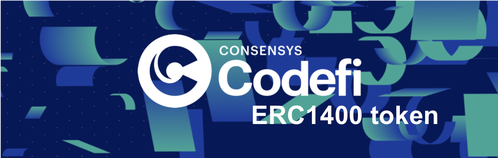
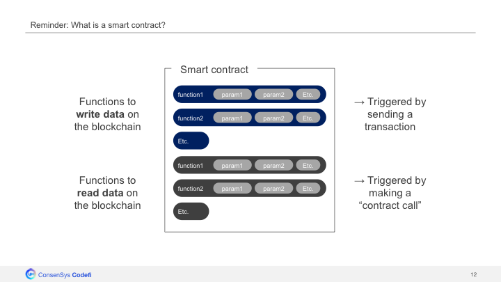
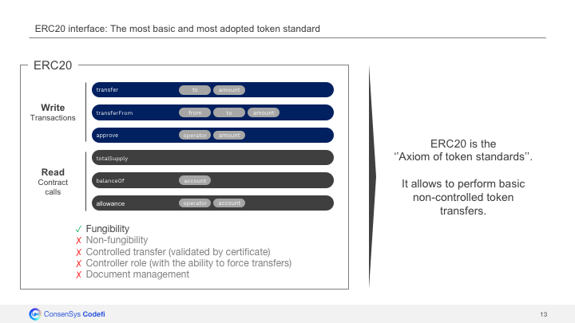
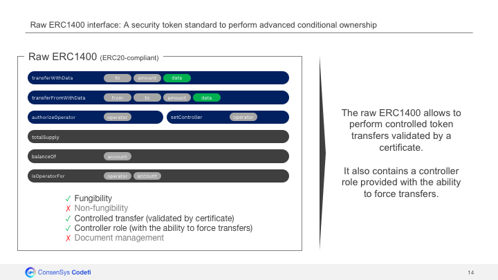
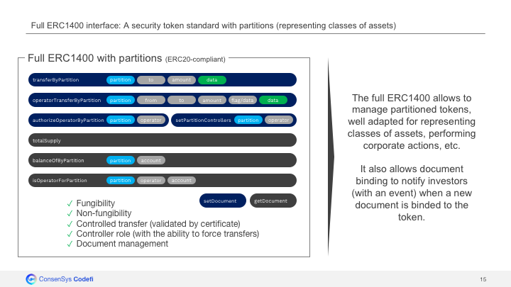
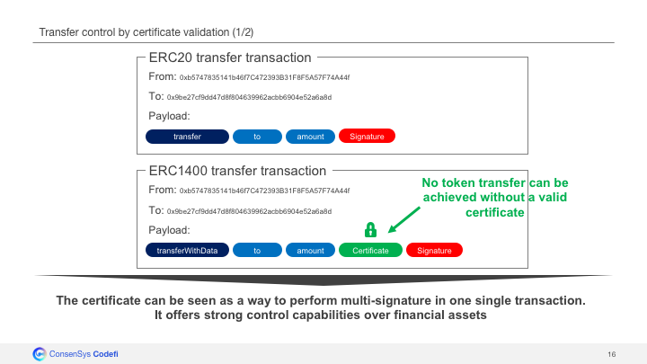
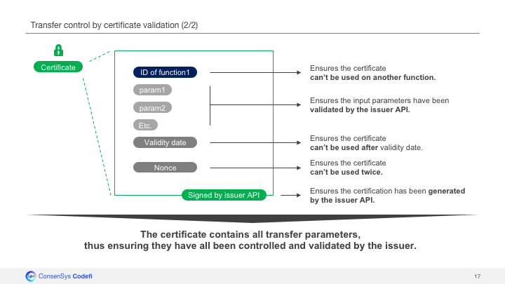
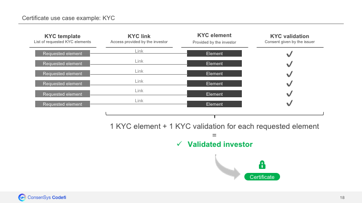

# Introduction

Blockchain technology and more specifically the emergence of "programmable" tokens have opened a world of new possibilities for financial assets: the creation of digital assets.
Digital assets are financial assets, which have been "tokenized". This means each asset is represented by a token on the blockchain.

Those tokens can be represented by multiple standards:
 - **ERC20** is the most basic and most adopted token standard. It can be seen as the "axiom of token standards" and is compatible with the majority of existing tools and platforms.
 - **ERC1400** is a more evolved standard, also ERC20-compliant, precisely designed for the use case of tokenized financial assets, allowing to perform highly controllable token transfers.

The following repository contains the ERC1400 implementation used by the Codefi Assets platform.


# What is Codefi Assets?

Codefi Assets is an advanced institutional technology platform for issuance and management of tokenized financial assets, powered by the Ethereum blockchain. Codefi Assets is a product created by ConsenSys.

https://codefi.consensys.net/codefiassets

### A platform for financial asset issuance & management

The current capital market still needs to overcome a few pain points:
 - Today, it is cumbersome and costly to issue an asset.
 - Once issued, the assets are mainly reserved for high-ticket investors.
 - Finally, those assets are not easily tradeable, which strongly limits the secondary market possibilities.

With Codefi Assets, we want to tokenize the capital market to tackle those pain points. In the new system, we imagine:
 - An asset issuance will be faster, simpler but also cheaper than today.
 - This reduction of costs will allow us to onboard smaller ticket investors.
 - Globally, the tokenization removes constraints for more liquid and frictionless asset transfers, while keeping a strong control over the market, thus liberating the secondary market.

### Video demo of an asset issuance platform based on Codefi Assets technology


Link to video:
https://www.youtube.com/watch?v=PjunjtIj02c


# Quick overview of token standards (ERC20, ERC1400) 







# Why do we use the ERC1400 token standard on Codefi Assets?

ERC1400 introduces additional features to ERC20 features, and provides issuers with strong control capabilities over their financial assets.

### Introduction - The limits of ERC20 token standard

Currently the most common and well-known standard within crypto community is the ERC20([eips.ethereum.org/EIPS/eip-20](https://eips.ethereum.org/EIPS/eip-20)).
The vast majority of ICOs are based on this ERC20 standard, but it doesn't appear to be the most relevant standard for financial asset tokenization.
The only parameters required to perform an ERC20 token transfer are the recipient's address and the value of the transfer, thus limiting the control possibilities over transfers:
```
function transfer(address recipient, uint256 value)
```
All controls have to be hard-coded on-chain and are often limited to simple/binary checks e.g. checking whether an investor is blacklisted or not.

Codefi Assets makes use of more evolved/granular controls to secure transfers.
Those controls can evolve quickly and require flexibility, which makes it difficult to hard-code them on-chain.

### Transfer controls based on certificates - A way to perform multisignature in one single transaction

The use of an additional 'data' parameter in the transfer functions can enable more evolved/granular controls:
```
function transferWithData(address recipient, uint256 value, bytes data)
```
Codefi Assets fosters to use this additional 'data' field, available in the ERC1400 standard, in order to inject a certificate generated off-chain by the issuer.
A token transfer shall be conditioned to the validity of the certificate, thus offering the issuer with strong control capabilities over its financial assets.



The Codefi certificate contains:
 - The function ID which ensures the certificate can’t be used on an other function.
 - The parameters which ensures the input parameters have been validated by the issuer.
 - A validity date which ensures the certificate can’t be used after validity date.
 - A nonce which ensures the certificate can’t be used twice.

Finally the certificate is signed by the issuer which ensures it is authentic.

The certificate enables the issuer to perform advanced conditional ownership, since he needs to be aware of all parameters of a transaction before generating the associated certificate.



In a way, this can be seen as a way to perform multisignature in one single transaction since every asset transfer requires:
 - A valid transaction signature (signed by the investor)
 - A valid certificate signature (signed by the issuer)

 ### Example use case
 
 An example use case for the certificate validation is KYC verification.

 The certificate generator can be coupled to a KYC API, and only provide certificates to users who've completed their KYC verification before.

 

PS: Since the ERC1400 standard is agnostic about the way to control certificate, we didn't include our certificate controller in this repository (a mock is used instead). In order to perform real advanced conditional ownership, a certificate controller called 'CertificateController.sol' shall be placed in folder '/contracts/CertificateController' instead of the mock placed there.


# Description of ERC1400 standard

ERC1400 introduces new concepts on top of ERC20 token standard:
 - **Granular transfer controls**: Possibility to perform granular controls on the transfers with a system of certificates (injected in the additional `data` field of the transfer method)
 - **Controllers**: Empowerment of controllers with the ability to send tokens on behalf of other addresses (e.g. force transfer).
 - **Partionned tokens** (partial-fungibility): Every ERC1400 token can be partitioned. The partition of a token, can be seen as the state of a token. It is well adapted for representing, classes of assets, performing corporate actions, etc.
 - **Document management**: Possibility to bind tokens to hashes of legal documents, thus making the link between a blockchain transaction and the real world.

Optionally, the following features can also be added:
 - **Hooks**: Possibility for token senders/recipients to setup hooks, e.g. automated actions executed everytime they send/receive tokens, thanks to [ERC1820](http://eips.ethereum.org/EIPS/eip-1820).
 - **Upgradeability**: Use of ERC1820([eips.ethereum.org/EIPS/eip-1820](http://eips.ethereum.org/EIPS/eip-1820)) as central contract registry to follow smart contract migrations.


# Focus on ERC1400 implementation choices

The original submission with discussion can be found at: [github.com/ethereum/EIPs/issues/1411](https://github.com/ethereum/EIPs/issues/1411).

We've performed a few updates compared to the original submission, mainly to fit with business requirements + to save gas cost of contract deployment.

#### Choices made to fit with business requirements
 - Introduction of sender/recipient hooks ([IERC1400TokensRecipient](contracts/token/ERC1400Raw/IERC1400TokensRecipient.sol), [IERC1400TokensSender](contracts/token/ERC1400Raw/IERC1400TokensSender.sol)). Those are inspired by [ERC777 hooks]((https://eips.ethereum.org/EIPS/eip-777)), but they have been updated in order to support partitions, in order to become ERC1400-compliant.
 - Modification of view functions ('canTransferByPartition', 'canOperatorTransferByPartition') as consequence of our certificate design choice: the view functions need to have the exact same parameters as 'transferByPartition' and 'operatorTransferByPartition' in order to be in measure to confirm the certificate's validity.
 - Introduction of validator hook ([IERC1400TokensValidator](contracts/token/ERC1400Raw/IERC1400TokensValidator.sol)), to manage updates of the transfer validation policy across time (certificate, whitelist, blacklist, lock-up periods, investor caps, pauseability, etc.), thanks an upgradeable module.
 - Extension of ERC20's allowance feature to support partitions, in order to become ERC1400-compliant. This is particularly important for secondary market and delivery-vs-payment.
 - Possibility to migrate contract, and register new address in ERC1820 central registry, for smart contract upgradeability.

#### Choices made to save gas cost of contract deployment
 - Removal of controller functions ('controllerTransfer' and 'controllerRedeem') and events ('ControllerTransfer' and 'ControllerRedemption') to save gas cost of contract deployment. Those controller functionalities have been included in 'operatorTransferByPartition' and 'operatorRedeemByPartition' functions instead.
 - Export of 'canTransferByPartition' and 'canOperatorTransferByPartition' in optional checker hook [IERC1400TokensChecker](contracts/token/ERC1400Raw/IERC1400TokensChecker.sol) as those functions take a lot of place, although they are not essential, as the result they return can be deduced by calling other view functions of the contract.


# Interfaces

For better readability, ER1400 contract has been structured into different parts:
 - [ERC1400Raw](contracts/token/ERC1400Raw/ERC1400Raw.sol), contains the minimum logic, recommanded to manage financial assets: granular transfer controls with certificate, controllers, hooks, migrations
 - [ERC1400Partition](contracts/token/ERCC1400Partition/ERC1400Partition.sol), introduces the concept of partitionned tokens (partial fungibility)
 - [ERC1400](contracts/token/ERC1400.sol), adds the issuance/redemption logic
 - [ERC1400ERC20](contracts/token/ERC20/ERC1400ERC20.sol), adds the ERC20 retrocompatibility

### ERC1400Raw interface

ERC1400Raw can be used:
 - Either as a sub-contract of ERC1400Partition
 - Or as a standalone contract, in case partitions are not required for the token

```
interface IERC1400Raw {

  // Token Information
  function name() external view returns (string);
  function symbol() external view returns (string);
  function totalSupply() external view returns (uint256);
  function balanceOf(address owner) external view returns (uint256);
  function granularity() external view returns (uint256);

  // Operators
  function controllers() external view returns (address[]);
  function authorizeOperator(address operator) external;
  function revokeOperator(address operator) external;
  function isOperator(address operator, address tokenHolder) external view returns (bool);
  event AuthorizedOperator(address indexed operator, address indexed tokenHolder);
  event RevokedOperator(address indexed operator, address indexed tokenHolder);

  // Token Transfers
  function transferWithData(address to, uint256 value, bytes data) external;
  function transferFromWithData(address from, address to, uint256 value, bytes data, bytes operatorData) external;

  // Token Issuance/Redemption
  function redeem(uint256 value, bytes data) external;
  function redeemFrom(address from, uint256 value, bytes data, bytes operatorData) external;
  event Issued(address indexed operator, address indexed to, uint256 value, bytes data, bytes operatorData);
  event Redeemed(address indexed operator, address indexed from, uint256 value, bytes data, bytes operatorData);

}
```

### ERC1400Partition interface

ERC1400Partition adds an additional feature on top of ERC1400Raw properties: the possibility to partition tokens (partial-fungibility property).
This property allows to perform corporate actions, like mergers and acquisitions, which is essential for financial assets.

```
interface IERC1400Partition {

    // Token Information
    function balanceOfByPartition(bytes32 partition, address tokenHolder) external view returns (uint256);
    function partitionsOf(address tokenHolder) external view returns (bytes32[]);

    // Token Transfers
    function transferByPartition(bytes32 partition, address to, uint256 value, bytes data) external returns (bytes32);
    function operatorTransferByPartition(bytes32 partition, address from, address to, uint256 value, bytes data, bytes operatorData) external returns (bytes32);
    event TransferByPartition(
        bytes32 indexed fromPartition,
        address operator,
        address indexed from,
        address indexed to,
        uint256 value,
        bytes data,
        bytes operatorData
    );
    event ChangedPartition(
        bytes32 indexed fromPartition,
        bytes32 indexed toPartition,
        uint256 value
    );

    // Default Partition Management
    function getDefaultPartitions(address tokenHolder) external view returns (bytes32[]);
    function setDefaultPartitions(bytes32[] partitions) external;

    // Operators
    function controllersByPartition(bytes32 partition) external view returns (address[]);
    function authorizeOperatorByPartition(bytes32 partition, address operator) external;
    function revokeOperatorByPartition(bytes32 partition, address operator) external;
    function isOperatorForPartition(bytes32 partition, address operator, address tokenHolder) external view returns (bool);
    event AuthorizedOperatorByPartition(bytes32 indexed partition, address indexed operator, address indexed tokenHolder);
    event RevokedOperatorByPartition(bytes32 indexed partition, address indexed operator, address indexed tokenHolder);

}
```

### ERC1400 interface

ERC1400 adds issuance/redemption + document management logics upon ERC1400Partition.
```
interface IERC1400 {

    // Document Management
    function getDocument(bytes32 name) external view returns (string, bytes32);
    function setDocument(bytes32 name, string uri, bytes32 documentHash) external;
    event Document(bytes32 indexed name, string uri, bytes32 documentHash);

    // Controller Operation
    function isControllable() external view returns (bool);

    // Token Issuance
    function isIssuable() external view returns (bool);
    function issueByPartition(bytes32 partition, address tokenHolder, uint256 value, bytes data) external;
    event IssuedByPartition(bytes32 indexed partition, address indexed operator, address indexed to, uint256 value, bytes data, bytes operatorData);

    // Token Redemption
    function redeemByPartition(bytes32 partition, uint256 value, bytes data) external;
    function operatorRedeemByPartition(bytes32 partition, address tokenHolder, uint256 value, bytes data, bytes operatorData) external;
    event RedeemedByPartition(bytes32 indexed partition, address indexed operator, address indexed from, uint256 value, bytes data, bytes operatorData);

    // Transfer Validity
    function canTransferByPartition(bytes32 partition, address to, uint256 value, bytes data) external view returns (byte, bytes32, bytes32);
    function canOperatorTransferByPartition(bytes32 partition, address from, address to, uint256 value, bytes data, bytes operatorData) external view returns (byte, bytes32, bytes32);

}
```

### ERC1400ERC20 interface

Finally ERC1400ERC20 introduces the last missing layer: ERC20 retrocompatibility. It is not mandatory but quite essential, because it ensures the token is compatible with all ERC20-compliant platforms.

```
interface IERC20 {

    // Token Information
    function totalSupply() external view returns (uint256);
    function balanceOf(address account) external view returns (uint256);

    // Token Transfers
    function transfer(address recipient, uint256 amount) external returns (bool);
    function transferFrom(address sender, address recipient, uint256 amount) external returns (bool);
    event Transfer(address indexed from, address indexed to, uint256 value);

    // Allowances
    function allowance(address owner, address spender) external view returns (uint256);
    function approve(address spender, uint256 amount) external returns (bool);
    event Approval(address indexed owner, address indexed spender, uint256 value);

}
```

NB: [ERC1400RawERC20](contracts/token/ERC20/ERC1400RawERC20.sol) has been created in case ERC20 retrocompatibility is required, but not the partitions.


## Quick start: How to test the contract?

Prerequisites: please make sure you installed "yarn" on your environment.
```
$ brew install yarn
```

Make sure your node version is <=10.x.x. (yarn command fails for more recent node versions).

Test the smart contract, by running the following commands:
```
$ git clone git@github.com:ConsenSys/ERC1400.git
$ cd ERC1400
$ yarn
$ yarn coverage
```


## How to deploy the contract on a blokchain network?

#### Step1: Define Ethereum wallet and Ethereum network to use in ".env" file

A few environment variables need to be specified. Those can be added to a ".env" file: a template of it can be generated with the following command:
```
$ yarn env
```

The ".env" template contains the following variables:

MNEMONIC - Ethereum wallets which will be used by the webservice to sign the transactions - [**MANDATORY**] (see section "How to get a MNEMONIC?" in appendix)

INFURA_API_KEY - Key to access an Ethereum node via Infura service (for connection to mainnet or ropsten network) - [OPTIONAL - Only required if NETWORK = mainnet/ropsten] (see section "How to get an INFURA_API_KEY?" in appendix)

#### Step2: Deploy contract

**Deploy contract on ganache**

In case ganache is not installed:
```
$ yarn global add ganache-cli
```
Then launch ganache:
```
$ ganache-cli
```

In a different console, deploy the contract by running the migration script:
```
$ yarn truffle migrate
```

**Deploy contract on ropsten**

Deploy the contract by running the migration script:
```
$ yarn truffle migrate --network ropsten
```


## APPENDIX

### How to get a MNEMONIC?

#### 1.Find a MNEMONIC

There are 2 options to get MNEMONIC:
 - Either generate 12 random words on https://iancoleman.io/bip39/ (BIP39 Mnemonic).
 - Or get the MNEMONIC generated by ganache with the following command:
```
$ ganache-cli
```
The second option is recommended for development purposes since the wallets associated to the MNEMONIC will be pre-loaded with ETH for tests on ganache.

#### 2.Load the wallet associated to the MNEMONIC with ether

If you've used ganache to generate your MNEMONIC and you only want to perform tests on ganache, you have nothing to do. The accounts are already loaded with 100 ETH.

For all other networks than ganache, you have to send ether to the accounts associated to the MNEMONIC:
 - Discover the accounts associated to your MNEMONIC thanks to https://www.myetherwallet.com/#view-wallet-info > Mnemonic phrase.
 - Send ether to those accounts.

### How to get an INFURA_API_KEY?

INFURA_API_KEY can be generated by creating an account on https://infura.io/
