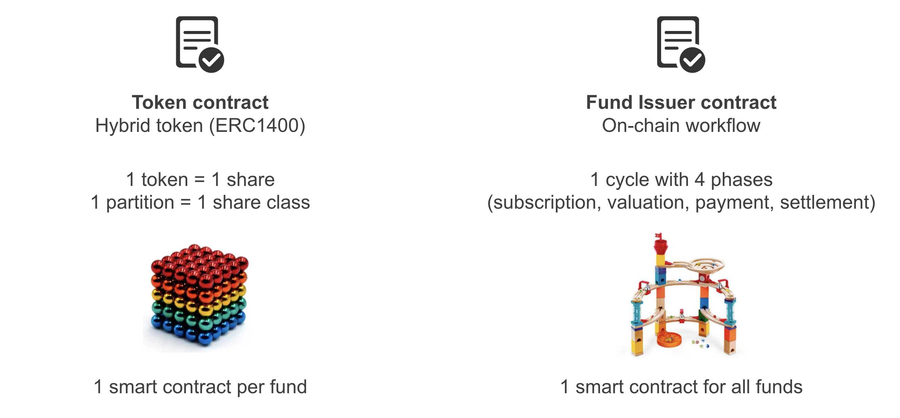
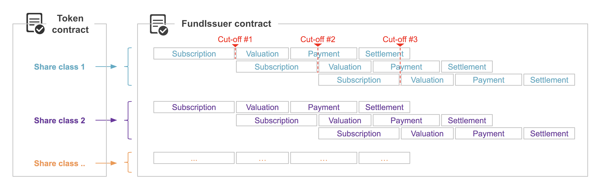
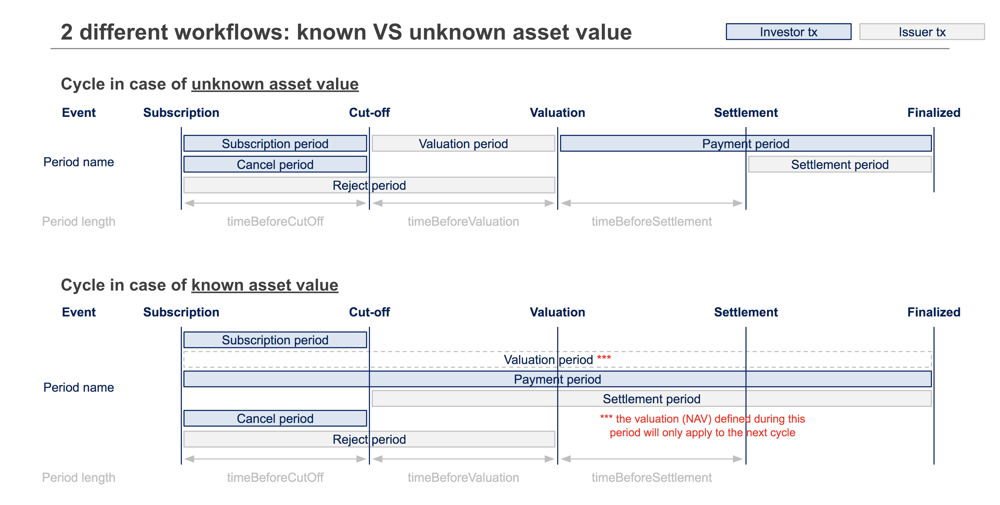

# Fund Issuer smart contract description

## Objective

The purpose of the contract is to allow perform a fund issuance on-chain.

## How does it work?

In order to perform a fund issuance on-chain, the following contracts are needed:
 - A hybrid token contract (1 token = 1 share; 1 partition = 1 share class)
 - A FundIssuer contract, which can be seen as the pipeline steering the token distribution

 

The steps to create a fund are the following:
 - Prerequisite: ensure a FundIssuer smart contract is deployed on the network. If not, deploy one.
 - Deploy the token contract (ERC1400)
 - Set the the FundIssuer contract as:
        - Minter: in order to allow him to mint tokens (/addMinter method)
        - Certificate signer: in order to allow him to manipulate tokens without requiring certificates (/setCertificateSigner method)
 - For each share class:
        - Launch issuance cycles in the FundIssuer contract (/setAssetRules method)

An issuance cycle consists in 4 periods:
 - Subscription: investors can subscribe by creating an order in the FundIssuer contract
 - Valuation: Once cut-off is past (end of subscription period), the NAV (net asset value) is set by the issuer in the smart contract
 - Payment: Investors pay for their order
 - Settlement: Issuers settle the orders, thus issuing tokens for the investors

  

The FundIssuer smart contract covers 2 different use cases:
 - Unknown asset value (NAV): the asset value needs to be injected in the smart contract at every valuation period, by a "Price Oracle". Investors need to wait until the end of the valuation period before paying for their order.
 - Known asset value (NAV): the asset value is already known at the beginning of the cycle. This allows investors to pay at the same time as they subscribe.

  